# 🍔🔥 Artesanal do Paizão — Landing Page Oficial

<div align="center">

**Landing page moderna, responsiva e interativa desenvolvida para a hamburgueria Artesanal do Paizão.**

Uma experiência digital criada para fortalecer a identidade da marca, apresentar seus principais produtos e direcionar clientes de forma rápida para os canais de pedido, localização e redes sociais.

<br>


</div>

---

# 📖 Sobre o projeto

O **Artesanal do Paizão** é uma landing page desenvolvida com foco em experiência visual, identidade de marca, velocidade de navegação e conversão.

O projeto foi pensado para transformar a presença digital da hamburgueria em algo mais profissional, moderno e atrativo, utilizando uma identidade visual baseada em:

- 🔥 fogo e brasa;
- 🍔 hambúrguer artesanal;
- 🟠 tons quentes de laranja e cobre;
- ⚫ preto e carvão;
- 🪵 elementos que remetem à churrasqueira e ao preparo artesanal;
- ✨ animações e microinterações.

Ao invés de criar um novo sistema de pedidos, a aplicação atua como uma **porta de entrada digital para a marca**, direcionando o cliente para plataformas e canais já utilizados pela hamburgueria.

O usuário pode conhecer os produtos, visualizar a identidade da empresa, acessar o Instagram, abrir a localização, entrar em contato pelo WhatsApp e realizar o pedido através da plataforma de delivery.

---

# 🎯 Objetivo

O principal objetivo do projeto é melhorar a presença digital do **Artesanal do Paizão**, criando uma interface que seja ao mesmo tempo:

- visualmente impactante;
- simples de navegar;
- responsiva;
- rápida;
- moderna;
- fácil de manter;
- preparada para futuras expansões.

A aplicação concentra os principais caminhos utilizados pelos clientes em uma única experiência.

---

# 🧠 Conceito da solução

A arquitetura foi propositalmente mantida simples.

Não existe necessidade de autenticação, banco de dados próprio ou sistema interno de pedidos dentro desta versão da landing page.

O fluxo principal funciona da seguinte maneira:

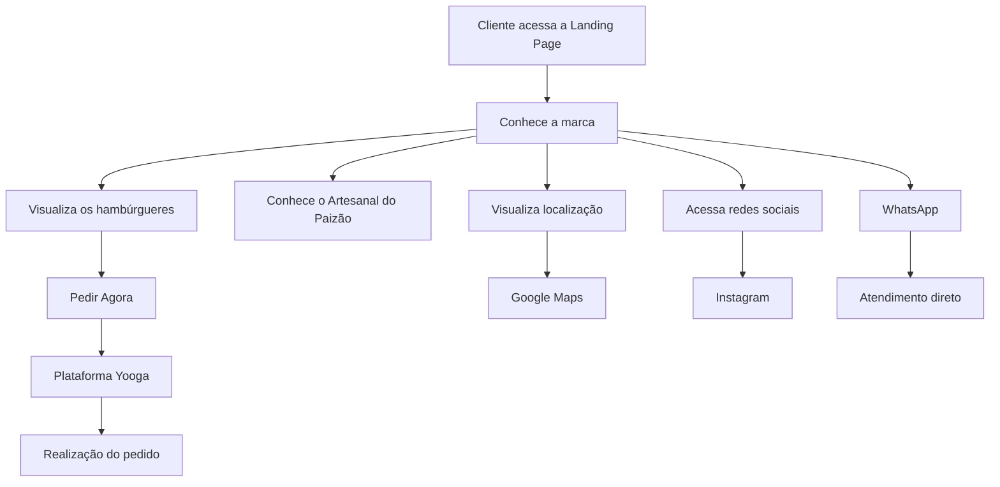

---

# 🏗️ Arquitetura

A aplicação segue uma arquitetura de frontend baseada em componentes React.

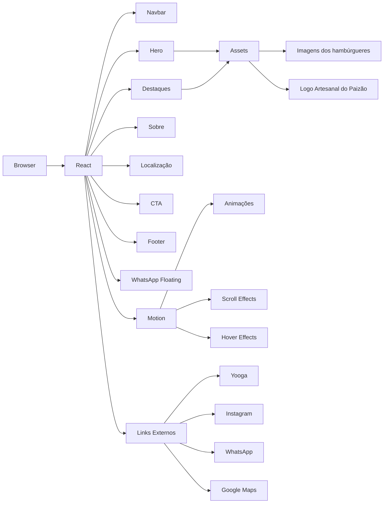

---

# 🔄 Fluxo do usuário

A experiência foi projetada para reduzir o número de etapas entre o cliente e o pedido.

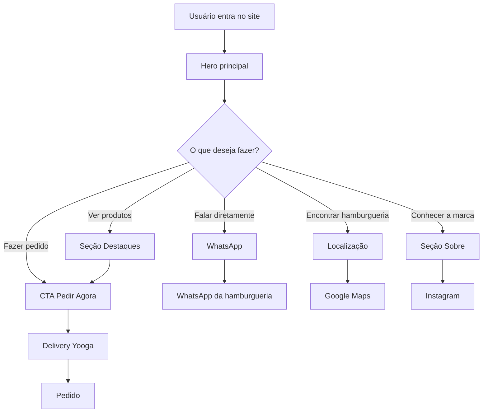

---

# 🛠️ Stack utilizada

## ⚛️ React

Utilizado para desenvolver a interface através de componentes reutilizáveis.

O React permite organizar a aplicação em diferentes seções, facilitando manutenção, evolução e reutilização de elementos.

---

## ⚡ Vite

O Vite é utilizado como ferramenta de desenvolvimento e build.

Ele oferece:

- inicialização extremamente rápida;
- Hot Module Replacement;
- build otimizado;
- integração simples com React;
- ambiente moderno de desenvolvimento.

---

## 🎨 Tailwind CSS

Utilizado como base para estilização e construção da interface.

O projeto utiliza uma identidade própria baseada em tons escuros e cores quentes.

### Paleta conceitual

```text
Carvão          #090604
Preto Quente    #1D100C
Marrom Fogo     #51321F
Cobre           #A48561
Laranja Brasa   #C85B1A
Creme           #DFD3C0
Branco Quente   #F6EFE5
```

---

## 🎬 Motion

Biblioteca utilizada para adicionar animações e interações à interface.

Entre os efeitos utilizados ou planejados estão:

- entrada suave dos componentes;
- efeitos baseados em scroll;
- parallax;
- elementos flutuantes;
- hover em cards;
- transformação de escala;
- transições;
- animações da hero section;
- microinterações.

---

## 🟨 JavaScript

Responsável pela lógica da interface, manipulação dos componentes e comportamento das interações.

---

## 🧩 SVG

Ícones vetoriais são utilizados diretamente na aplicação, reduzindo dependências externas e permitindo maior controle visual.

---

## 🐙 Git + GitHub

Utilizados para versionamento e armazenamento do código-fonte.

O histórico de commits permite acompanhar a evolução do projeto e manter versões seguras da aplicação.

---

# 🧱 Estrutura da aplicação

```text
artesanal-paizao-landing/
│
├── public/
│
├── src/
│   │
│   ├── assets/
│   │   ├── burguer-hero.jpg
│   │   ├── burguer1.jpg
│   │   ├── burguer2.jpg
│   │   ├── burguer3.jpg
│   │   └── logo-paizao.jpg
│   │
│   ├── App.jsx
│   ├── index.css
│   └── main.jsx
│
├── .gitignore
├── index.html
├── package.json
├── package-lock.json
├── vite.config.js
└── README.md
```

---

# 🖥️ Componentes principais

## 🧭 Navbar

Barra de navegação utilizada para acesso às principais áreas do site.

### Navegação

```text
Início
Destaques
Sobre
Localização
Instagram
WhatsApp
Pedir Agora
```

Possui comportamento responsivo para desktop e dispositivos móveis.

---

# 🔥 Hero Section

Principal área visual da landing page.

Responsável por apresentar imediatamente a identidade do **Artesanal do Paizão**.

A seção utiliza:

- imagem principal de hambúrguer;
- identidade da marca;
- efeitos de iluminação;
- gradientes;
- elementos relacionados a fogo e brasa;
- CTA de pedido;
- animações;
- efeitos de profundidade.

---

# 🍔 Destaques

Área responsável pela apresentação dos hambúrgueres em evidência.

Entre os produtos apresentados estão:

### TASTY DO PZ

Produto apresentado através de card visual interativo.

### TRIPLO ARTESANAL GERGILLIM

Hambúrguer artesanal de destaque utilizado na apresentação visual do projeto.

### ONION BURGUER GERGILIM

Produto apresentado como uma das opções principais da hamburgueria.

Os preços não são exibidos diretamente na landing page, evitando informações desatualizadas caso os valores sejam modificados no sistema oficial de delivery.

---

# ✨ Cards interativos

Os cards de produto utilizam recursos visuais como:

```text
Hover
↓
Elevação do card
↓
Aumento suave da imagem
↓
Sombra dinâmica
↓
Glow
↓
Realce de borda
↓
CTA para pedido
```

Fluxo:

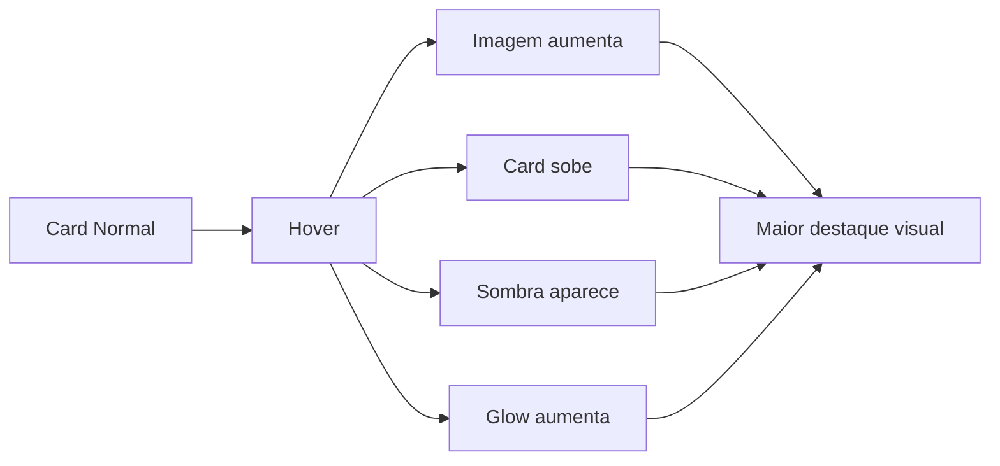

---

# 🔥 Identidade visual

A interface foi criada para transmitir características diretamente associadas ao produto.

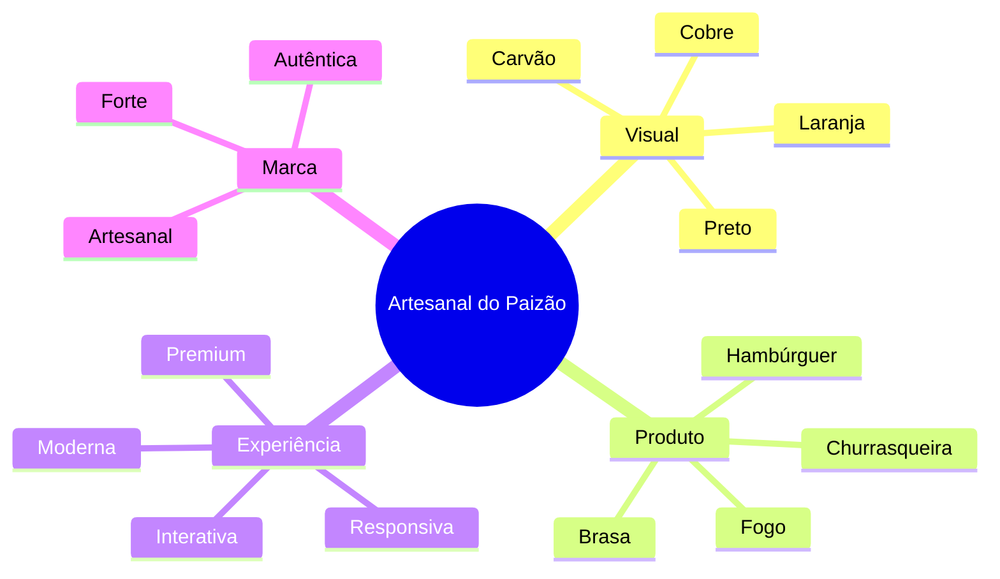

---

# 📱 Responsividade

O site foi desenvolvido para funcionar em diferentes tamanhos de tela.

```text
🖥️ Desktop
       ↓
💻 Notebook
       ↓
📱 Tablet
       ↓
📲 Smartphone
```

A interface adapta:

- navegação;
- tamanho de textos;
- imagens;
- cards;
- espaçamentos;
- botões;
- seções;
- alinhamentos.

---

# 🎞️ Animações

As animações possuem função visual e funcional.

Elas ajudam a criar uma experiência mais moderna sem comprometer a navegação.

Entre os conceitos utilizados estão:

```text
Reveal on Scroll
Parallax
Hover Lift
Image Zoom
Glow
Floating Elements
Smooth Transitions
Animated Marquee
Pulse Effects
Glassmorphism
```

---

# 🪟 Glassmorphism

Alguns elementos utilizam transparência, blur e bordas sutis para criar sensação de profundidade.

Conceito:

```css
background: rgba(...);
backdrop-filter: blur(...);
border: 1px solid rgba(...);
```

Isso permite manter a estética escura da marca enquanto cria separação visual entre os elementos.

---

# 🔥 Glow e sombras

Os elementos interativos utilizam sombras e iluminação inspiradas em brasas.

O objetivo é criar a sensação de que determinados componentes estão sendo iluminados por fogo.

```text
Elemento
   ↓
Interação
   ↓
Glow Laranja
   ↓
Sombra
   ↓
Profundidade
```

---

# 📲 Integrações

A landing page funciona como ponto central entre o cliente e os serviços externos utilizados pela hamburgueria.

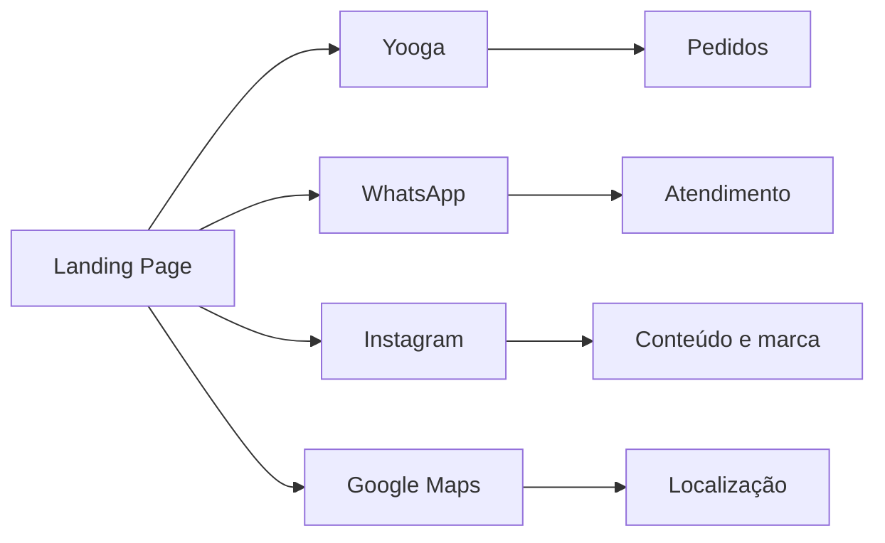

---

# 🛒 Delivery

O sistema de pedidos não é implementado diretamente no site.

Ao clicar em **Pedir Agora**, o usuário é direcionado para a plataforma oficial utilizada pela hamburgueria.

### Fluxo

```text
Landing Page
     ↓
Pedir Agora
     ↓
Yooga
     ↓
Cardápio
     ↓
Pedido
```

Essa abordagem reduz a complexidade da aplicação e evita duplicação da infraestrutura de pedidos.

---

# 📸 Instagram

A integração com Instagram permite direcionar o usuário para o perfil oficial da marca.

Isso facilita:

- descoberta de novos produtos;
- campanhas;
- promoções;
- contato com a marca;
- conteúdo visual;
- crescimento das redes sociais.

---

# 💬 WhatsApp

O WhatsApp funciona como canal direto de comunicação.

A aplicação possui suporte para botão dedicado e botão flutuante.

```text
Cliente
   ↓
WhatsApp Floating Button
   ↓
WhatsApp
   ↓
Atendimento
```

---

# 📍 Localização

A seção de localização permite que o cliente encontre rapidamente a hamburgueria.

O fluxo pode direcionar diretamente para o Google Maps.

```text
Site
 ↓
Localização
 ↓
Google Maps
 ↓
Rota até o estabelecimento
```

---

# ⚙️ Instalação

Clone o repositório:

```bash
git clone https://github.com/jmrzd/artesanal-paizao-landing.git
```

Entre no projeto:

```bash
cd artesanal-paizao-landing
```

Instale as dependências:

```bash
npm install
```

Execute o projeto:

```bash
npm run dev
```

---

# 🌐 Ambiente de desenvolvimento

Após executar:

```bash
npm run dev
```

o Vite disponibilizará um endereço local semelhante a:

```text
http://localhost:5173
```

---

# 📦 Build de produção

Para gerar a versão otimizada:

```bash
npm run build
```

O Vite criará:

```text
dist/
```

Essa pasta contém os arquivos preparados para produção.

---

# 🔍 Visualizar build

Para testar o build localmente:

```bash
npm run preview
```

---

# 🧪 Validação

Antes de publicar uma nova versão:

```bash
npm run build
```

O build permite detectar problemas relacionados a:

- imports;
- dependências;
- sintaxe;
- arquivos ausentes;
- compilação.

---

# 🌿 Git Flow simplificado

O desenvolvimento atualmente utiliza a branch principal:

```text
main
```

Fluxo básico:

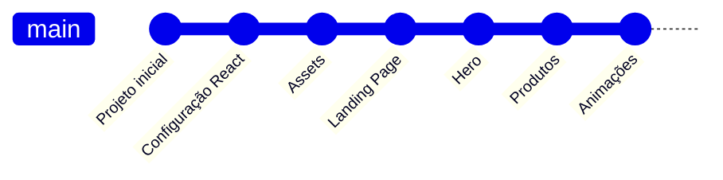

---

# 📌 Padrão de commits

O projeto utiliza mensagens inspiradas em Conventional Commits.

### Nova funcionalidade

```bash
git commit -m "feat: adiciona nova seção"
```

### Correção

```bash
git commit -m "fix: corrige responsividade da hero"
```

### Documentação

```bash
git commit -m "docs: atualiza README"
```

### Estilo

```bash
git commit -m "style: melhora espaçamentos e identidade visual"
```

### Refatoração

```bash
git commit -m "refactor: reorganiza componentes"
```

---

# 🧩 Fluxo de desenvolvimento

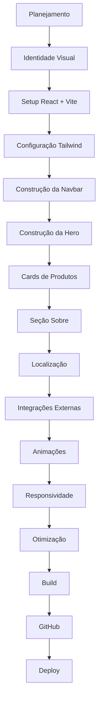

---

# 📊 Arquitetura tecnológica

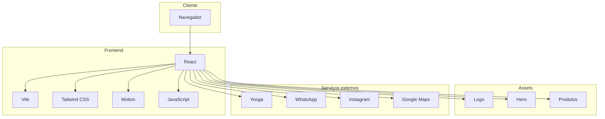

---

# 💡 Decisões de arquitetura

## Por que React?

React permite criar componentes independentes e reutilizáveis, facilitando futuras modificações na interface.

---

## Por que Vite?

O Vite oferece um ambiente de desenvolvimento extremamente rápido e uma configuração simples para projetos modernos em React.

---

## Por que não existe backend?

A versão atual da aplicação não necessita armazenar informações próprias do cliente.

Os pedidos são realizados através da plataforma de delivery utilizada pelo estabelecimento.

Portanto:

```text
Sem autenticação
Sem carrinho interno
Sem banco de dados próprio
Sem processamento de pagamento
Sem gerenciamento de pedidos
```

Isso reduz custos e complexidade.

---

# 🚀 Benefícios da arquitetura

### Menor complexidade

A aplicação possui responsabilidade clara: apresentar a marca e direcionar o usuário.

### Fácil manutenção

Mudanças visuais podem ser realizadas diretamente no frontend.

### Maior velocidade

Não existe necessidade de comunicação constante com um backend próprio.

### Menor custo

A infraestrutura necessária para manter uma landing page é significativamente menor.

### Escalabilidade

Caso futuramente seja necessário, novos serviços podem ser integrados.

---

# 🔮 Possíveis evoluções

O projeto pode receber novas funcionalidades no futuro, como:

- CMS para alteração de produtos;
- painel administrativo;
- cardápio próprio;
- integração com API;
- sistema de promoções;
- analytics;
- eventos de conversão;
- Google Analytics;
- SEO avançado;
- imagens WebP/AVIF;
- otimização automática de assets;
- avaliações de clientes;
- campanhas;
- cupons;
- notificações;
- integração com outras plataformas de delivery.

---

# ⚡ Performance

Uma das etapas do projeto é a otimização dos recursos visuais.

Entre as melhorias possíveis:

```text
JPG/PNG
   ↓
Compressão
   ↓
WebP / AVIF
   ↓
Menor tamanho
   ↓
Menor tempo de carregamento
   ↓
Melhor experiência
```

Também são utilizados recursos como:

```html
loading="lazy"
```

para imagens que não precisam ser carregadas imediatamente.

---

# ♿ Acessibilidade

O projeto busca manter boas práticas como:

- textos legíveis;
- contraste adequado;
- elementos clicáveis;
- links semanticamente corretos;
- suporte a navegação responsiva;
- atributos `alt` em imagens;
- redução de animações quando solicitado pelo sistema operacional.

Exemplo:

```css
@media (prefers-reduced-motion: reduce) {
  /* redução das animações */
}
```

---

# 🔎 SEO

A aplicação pode ser preparada para mecanismos de busca através de:

- título correto;
- meta description;
- Open Graph;
- favicon;
- texto semântico;
- headings organizados;
- imagens otimizadas;
- URLs adequadas.

Estrutura conceitual:

```text
Google
  ↓
Landing Page
  ↓
Marca
  ↓
Produtos
  ↓
Localização
  ↓
Pedido
```

---

# 🧠 Experiência do usuário

O design da landing page segue um caminho de conversão.

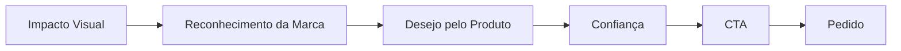

A intenção não é apenas mostrar conteúdo.

O objetivo é direcionar o usuário para uma ação.

---

# 🎯 Conversão

Os principais CTAs são posicionados estrategicamente para facilitar ações como:

```text
PEDIR AGORA
WHATSAPP
INSTAGRAM
LOCALIZAÇÃO
```

Dessa forma, o usuário não precisa procurar informações importantes fora do site.

---

# 🎨 Design System

## Background

Tons escuros representam carvão e churrasqueira.

## Accent

Laranja representa fogo, calor e brasa.

## Tons claros

Creme e branco quente são usados para aumentar a legibilidade e criar contraste.

## Sombras

Sombras profundas ajudam a separar componentes do background.

## Glow

Iluminação alaranjada reforça o conceito de brasa.

---

# 🍔 Experiência visual

A imagem dos produtos possui papel central na interface.

A combinação de:

```text
Fotografia gastronômica
+
Fundo escuro
+
Iluminação quente
+
Animações
+
Tipografia forte
```

cria uma apresentação focada no produto.

---

# 📱 Mobile First Experience

Grande parte dos clientes de hamburguerias acessa links através de dispositivos móveis e redes sociais.

Por isso, a navegação mobile recebe atenção especial.

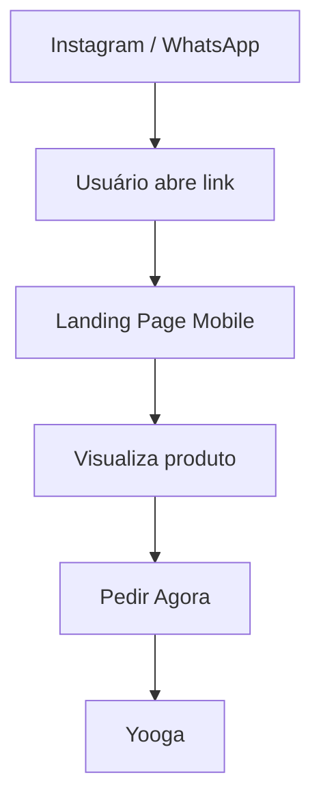

---

# 🛡️ Segurança

Como a landing page não recebe senhas, dados financeiros ou informações privadas diretamente, sua superfície de ataque é reduzida.

Informações sensíveis relacionadas a pedidos e pagamentos permanecem sob responsabilidade das plataformas externas utilizadas pela empresa.

---

# 📋 Status do projeto

```text
✅ Setup React
✅ Vite
✅ Tailwind CSS
✅ Identidade visual
✅ Logo
✅ Hero Section
✅ Cards de produtos
✅ Navegação
✅ Responsividade base
✅ Integração com links externos
✅ Animações
✅ Git
✅ GitHub
✅ Build funcionando

🔄 Otimização visual
🔄 Otimização de imagens
🔄 Ajustes finais de responsividade
🔄 SEO
🔄 Revisão dos links finais
🔜 Deploy de produção
```

---

# 🗺️ Roadmap

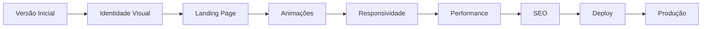

---

# 📈 Futuro

A arquitetura permite transformar a landing page em uma aplicação maior caso o negócio necessite.

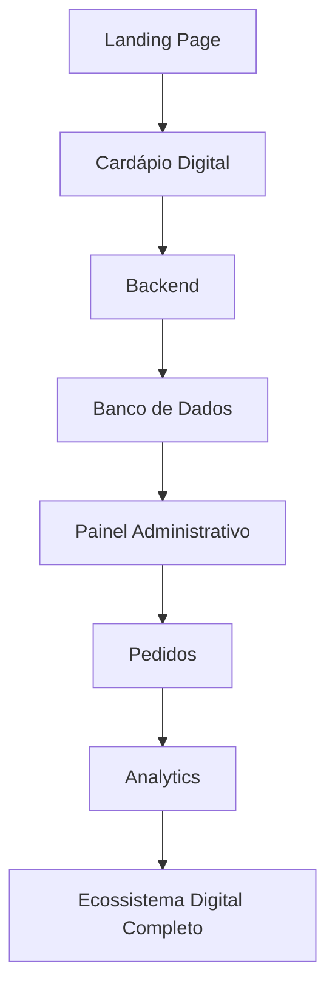

---

# 👨‍💻 Desenvolvimento

Projeto desenvolvido com foco em:

```text
Frontend Development
UI/UX
Responsividade
Performance
Animações
Identidade Visual
Git
GitHub
Deploy
Experiência do Usuário
```

---

# 🧑‍💻 Autor

**João Miguel — jmrzd**

Ciência da Computação

GitHub:

```text
https://github.com/jmrzd
```

---

# 🔗 Links

### Instagram

```text
https://www.instagram.com/artesanalpaizao/
```

### Delivery

```text
https://delivery.yooga.app/artesanalpaizao
```

---

# 📄 Licença

Projeto desenvolvido para fins comerciais e de portfólio.

A identidade visual, imagens, nome e demais elementos relacionados ao **Artesanal do Paizão** pertencem aos seus respectivos proprietários.

O código-fonte não deve ser reutilizado comercialmente sem autorização.

---

<div align="center">

# 🍔 ARTESANAL DO PAIZÃO 🔥

### Hambúrguer artesanal. Churrasqueira. Brasa. Sabor.

**Desenvolvido com React + Vite + Tailwind CSS**

🔥 🍔 🔥

</div>
